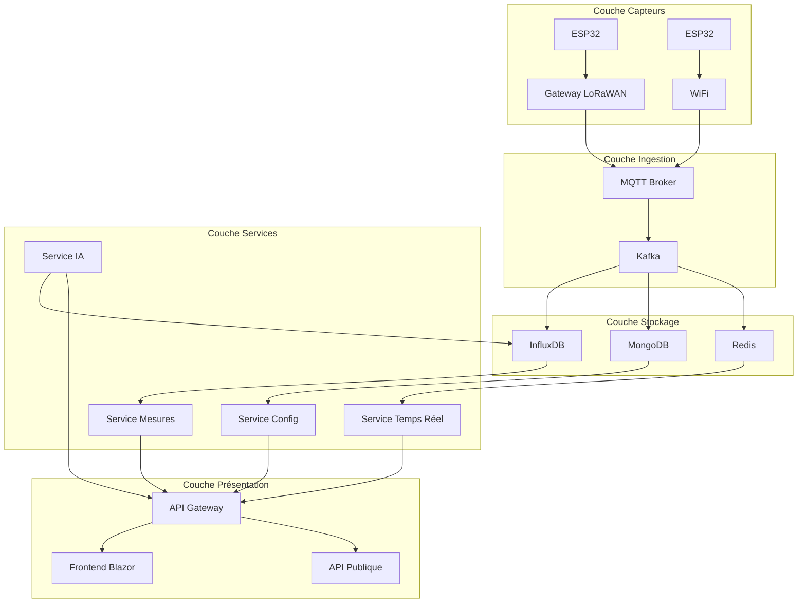

# Architecture GreenCity

## Vue d'ensemble



## Composants détaillés

### 1. Couche Capteurs

#### ESP32 + Capteurs
- **Hardware**: ESP32-WROOM-32
- **Firmware**: FreeRTOS + Arduino
- **Capteurs**:
  - DHT22 (température/humidité)
  - MH-Z19B (CO₂)
  - SDS011 (PM2.5/PM10)
- **Connectivité**: WiFi + LoRaWAN
- **Alimentation**: Solaire + Batterie

#### Gateway LoRaWAN
- **Hardware**: RAK7258
- **Protocole**: LoRaWAN 1.0.3
- **Couverture**: ~2km en urbain
- **Redondance**: Mesh networking

### 2. Couche Ingestion

#### MQTT Broker
- **Software**: Eclipse Mosquitto
- **QoS**: Niveau 1 (at least once)
- **Sécurité**: TLS 1.3 + Auth
- **Scalabilité**: Cluster mode

#### Apache Kafka
- **Version**: 3.5
- **Topics**:
  - raw.measurements
  - processed.measurements
  - alerts
- **Partitionnement**: Par zone géographique
- **Rétention**: 7 jours

### 3. Couche Stockage

#### InfluxDB
- **Usage**: Séries temporelles
- **Retention**: 
  - Hot data: 30 jours
  - Cold data: 12 mois
- **Downsampling**: Automatique
- **Backup**: Continu vers S3

#### MongoDB
- **Collections**:
  - devices
  - users
  - alerts
  - config
- **Sharding**: Par région
- **Indexation**: Géospatiale

#### Redis
- **Usage**:
  - Cache API
  - Pub/Sub temps réel
  - Rate limiting
- **Persistence**: RDB + AOF

### 4. Couche Services

#### Microservices (ASP.NET Core)
- **Service Mesures**:
  - Ingestion données
  - Validation
  - Agrégation
  - API CRUD

- **Service Configuration**:
  - Gestion devices
  - Paramètres système
  - Authentification
  - Autorisation

- **Service Temps Réel**:
  - WebSockets
  - Notifications
  - Alertes
  - Events

- **Service IA**:
  - Prédictions pollution
  - Détection anomalies
  - Cartographie thermique
  - Optimisation énergétique

### 5. Couche Présentation

#### API Gateway
- **Framework**: Ocelot
- **Fonctionnalités**:
  - Routage
  - Load balancing
  - Rate limiting
  - Caching
  - Logging
  - Monitoring

#### Frontend Blazor
- **Type**: WebAssembly
- **Composants**:
  - Cartes (Leaflet.js)
  - Graphiques (Chart.js)
  - Tableaux de bord
  - Formulaires

#### API Publique
- **Version**: v1
- **Format**: REST + JSON
- **Auth**: JWT
- **Documentation**: OpenAPI 3.0

## Déploiement

### Infrastructure
- **Cloud**: Azure
- **Containers**: Kubernetes
- **CI/CD**: GitHub Actions
- **Monitoring**: 
  - Prometheus
  - Grafana
  - ELK Stack

### Sécurité
- **Réseau**:
  - VPC isolé
  - WAF
  - DDoS protection
- **Données**:
  - Chiffrement at rest
  - TLS en transit
  - Key rotation

### Scalabilité
- **Horizontale**:
  - Auto-scaling
  - Load balancing
  - Session affinity
- **Verticale**:
  - Resource limits
  - Burst handling
  - Graceful degradation

## Flux de données

1. **Acquisition**:
   ```mermaid
   sequenceDiagram
       ESP32->>Gateway: Mesures brutes
       Gateway->>MQTT: Publication
       MQTT->>Kafka: Ingestion
   ```

2. **Traitement**:
   ```mermaid
   sequenceDiagram
       Kafka->>Service: Consommation
       Service->>InfluxDB: Stockage
       Service->>Redis: Cache
   ```

3. **Présentation**:
   ```mermaid
   sequenceDiagram
       Client->>Gateway: Requête
       Gateway->>Services: Routage
       Services->>Client: Réponse
   ```

## Monitoring

### Métriques clés
- Latence API
- Taux d'erreur
- Disponibilité services
- Utilisation ressources
- Qualité données

### Alerting
- PagerDuty
- Webhooks Discord
- Email
- SMS

## Disaster Recovery

### Backup
- Données: Quotidien
- Config: Continu
- Code: GitHub
- Infrastructure: Terraform

### Recovery
- RPO: 5 minutes
- RTO: 30 minutes
- Failover: Automatique
- Rollback: Manuel 