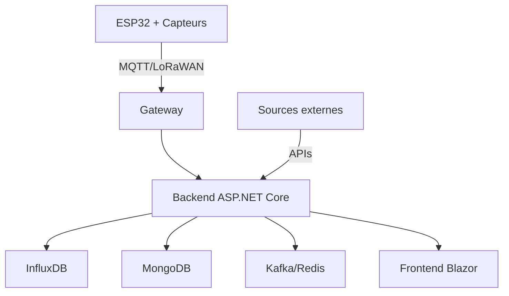

# Documentation Technique GreenCity

## Architecture globale



## Composants principaux

### 1. Hardware (ESP32)
- **Microcontrôleur**: ESP32-WROOM-32
- **Capteurs**:
  - DHT22: Température et humidité
  - MH-Z19B: CO₂
  - SDS011: Particules PM2.5/PM10
- **Alimentation**: Panneau solaire 5W + Batterie LiPo
- **Connectivité**: WiFi + LoRaWAN (zones sans WiFi)

### 2. Backend
- **Framework**: ASP.NET Core 8.0
- **Architecture**: Microservices avec Dapr
- **APIs**:
  - `/api/v1/measurements`: Données des capteurs
  - `/api/v1/predictions`: Prévisions IA
  - `/api/v1/alerts`: Système d'alertes
- **Sécurité**: JWT, HTTPS, Rate limiting

### 3. Bases de données
- **InfluxDB**: Séries temporelles (mesures)
- **MongoDB**: Métadonnées et configuration
- **Redis**: Cache et messages temps réel

### 4. Intelligence Artificielle
- **Modèles**:
  - Prédiction pollution: LSTM (TensorFlow)
  - Détection anomalies: Isolation Forest
  - Cartographie thermique: U-Net (OpenCV)

### 5. Frontend
- **Framework**: Blazor WebAssembly
- **Cartographie**: Leaflet.js + OpenStreetMap
- **Graphiques**: Chart.js pour visualisations
- **Temps réel**: SignalR pour updates live

## Configuration requise

### Matériel minimal
- ESP32 DevKit v1
- Capteurs environnementaux
- Serveur: 4 CPU, 8GB RAM, 100GB SSD

### Logiciel
- .NET SDK 8.0+
- Node.js 20+
- Docker et Docker Compose
- PlatformIO pour ESP32

## Déploiement

### 1. Infrastructure
```bash
# Déploiement des bases de données
docker-compose up -d influxdb mongodb redis

# Configuration Dapr
dapr init
dapr run --app-id greencity --app-port 5000
```

### 2. Backend
```bash
cd src/backend
dotnet restore
dotnet run --environment Production
```

### 3. Frontend
```bash
cd src/frontend
npm install
npm run build
```

### 4. Hardware
```bash
cd src/hardware
platformio run -t upload
```

## Monitoring

- Métriques système: Prometheus + Grafana
- Logs: ELK Stack
- Alerting: Grafana Alerts + Webhook Discord

## Sécurité

- TLS 1.3 obligatoire
- Authentification JWT
- Rate limiting par IP
- Validation données capteurs
- Chiffrement données sensibles 